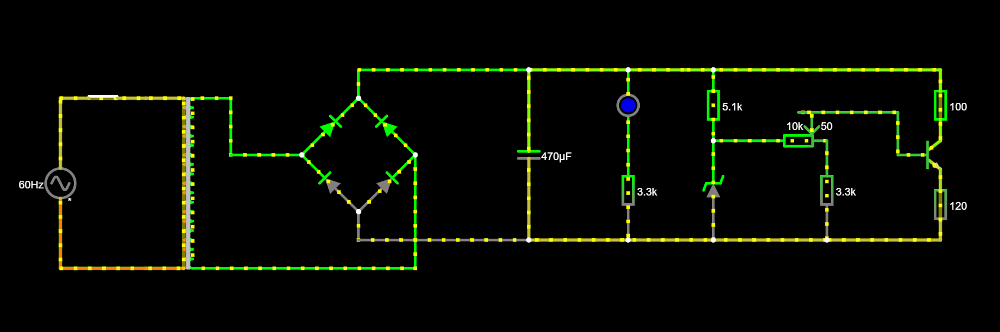
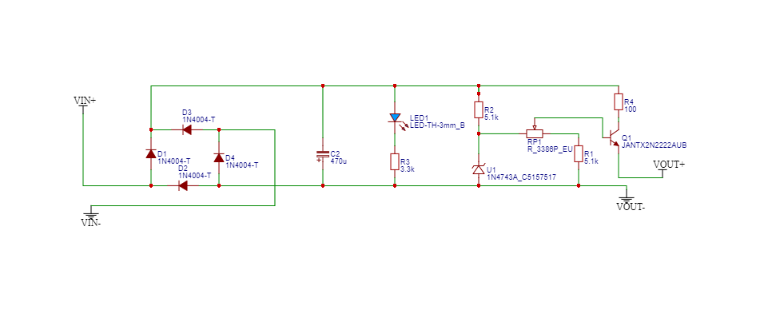
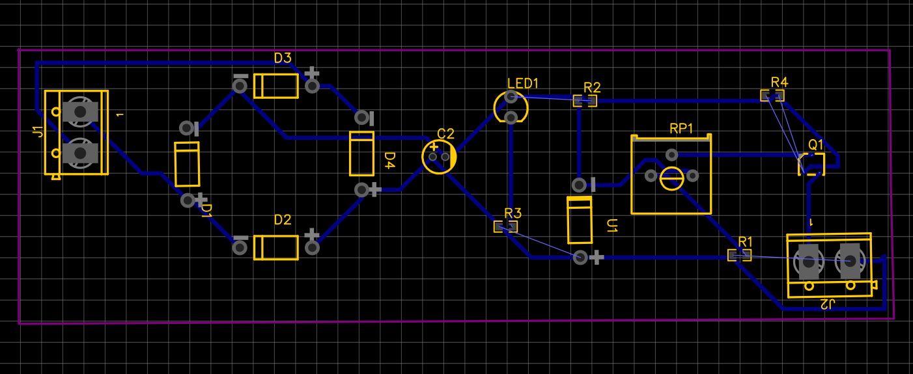
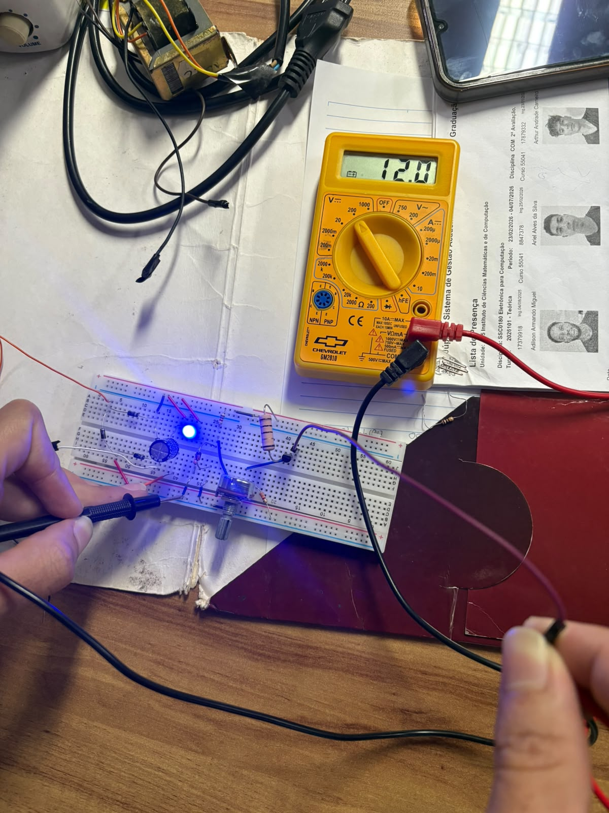
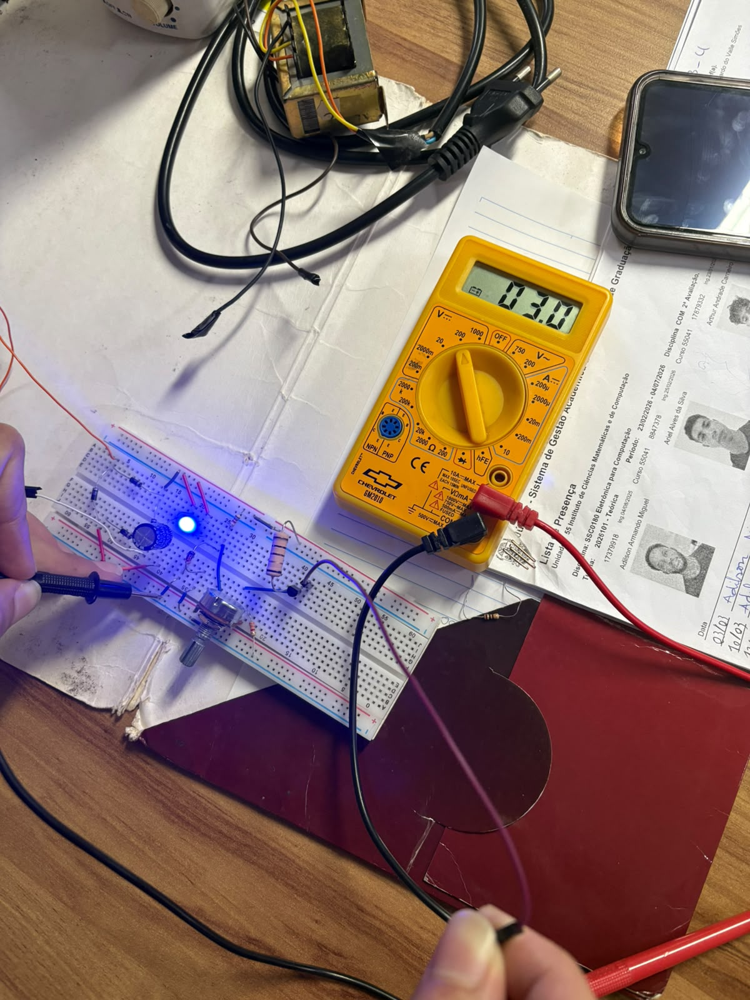

# Fonte de tensão variável
Projeto construído como o Trabalho 1 da disciplina de Eletrônica para Computação do curso de Ciência da Computação do 1° semestre no ICMC-USP.

## Descrição do projeto
O projeto consiste na construção de uma fonte de tensão capaz de retificar a corrente alternada de tensão eficaz 127V (aproximada 179,6V de pico) da tomada em uma corrente contínua, com tensão ajustável, por meio de um potenciômetro, entre 3V e 12V. 

A partir da tomada, teremos uma tensão eficaz de 127V, com corrente alternada e frequência de 60Hz. 

## Alunos
* Julia Barbosa Nogueira - 17901347 - [Github Julia Nogueira](https://github.com/juliab2nogueira)
* Carolina Goulart Kowalczuk - 13854629 - [Github Carolina Kowalczuk](https://github.com/kowalczukcarolina)
* Maria Rita Fagundes Vargas - 17912857 -  [Github Maria Rita Vargas](https://github.com/FV-MariaRita)
* Victor Hugo Adão de Oliveira - 17969072 - [Github Victor Adão](https://github.com/VihAdao)

## Componentes utilizados 
| Componentes        | Quantidade           | Valores  |
| ------------- |:-------------:| -----|
| Capacitor ELCO 470µF x 35V 105 C 10X16     | 2 | R$2,80 |
| Diodo Retificador 1N4007 LGE = 1N4004      | 10      | R$0,20 |
| Diodo Zenner 1N4743 13V 1W | 2      |    R$0,50 |
| LED 5MM Azul Difuso EVERLIGHT | 3 | R$0,50 |
| Potenciômetro 1W B10K B-16,5 x E-20-XR-7MM| 2   | R$7,00 |
| Transistor 2N2222A NPN 60V 0,8A TO-92 | 2  |  R$2,60 |
| Resistor CR25 5K1 Carvão TL | 10 | R$0,07 |
| Resistor CR25 3K3 Carvão | 10 | R$0,07 |
| Resistor CR25 4K7 Carvão ROHA | 10 | R$0,07 |
| Resistor 5W 100R 5% Metal Filme LGE | 2 | R$1,98 |
| Resistor 5W 120R 5% Metal Filme LGE | 2 | R$1,90|
| Jumper Macho x Macho (Kit com 10 peças) | 2 | R$7,00 |
| **Total** | | **R$53,16** |
  
## Descrição dos componentes utilizados

**Transformador (AC = 18,1 Vrms / Capacitor = 24,2V):** Reduz a tensão da tomada (127V) para alimentar o circuito em uma tensão menor, proporcional ao seu número de espiras em cada um dos lados.

**Ponte de Diodos:** Retifica (converte) a corrente alternada (AC) para corrente contínua (DC). Ela é formada por 4 diodos, cada um com 0,7V de tensão.

**Capacitor:** Armazena a energia elétrica temporariamente para liberá-la quando necessária, fazendo com que a tensão retificada seja filtrada para reduzir o ripple.

**Diodo Zener:** Estabiliza e regula a tensão do circuito, travando a tensão de referência em 13V.

**Resistor de Polarização:** Limita a corrente que passa pelo diodo zener para que ele não queime.

**Potenciômetro Linear:** Permite o ajuste manual da tensão de saída entre os valores de 3V e 12V exigidos pelo projeto.

**Transistor de Passagem:** Transistor de passagem funciona como um "copiador" de tensão. A tensão na saída (no emissor) será sempre a tensão do braço do potenciômetro menos a queda de tensão base-emissor do transistor(=0,7V). Ele funciona com 3 pinos, sendo eles: Coletor C, Base B e Emissor E.

Imagem do manual do Transistor de passagem 2N2222: 

**LED Azul:** Utilizado como indicador visual de que a fonte está ligada e em funcionamento.

**Resistores de Apoio:** 
1. Resistor de 3.3kΩ (em série com o LED): Limita a corrente que passa pelo LED indicador para não queimá-lo.
2. Resistor de 3.3kΩ (próximo ao Potenciômetro): Protege e estabiliza o sinal de controle (tensão de base) que vai para o transistor.
3. Resistor de 5.1kΩ: Limita o mínimo de tensão a 3V, para que mesmo ao girar o potenciômetro para o mínimo a tensão não zere.
4. Resistor de 100Ω: Dissipa a potência que o transistor teria que dissipar e limita a corrente que passa pelo coletor. 

## Cálculos

* **Tensão de Pico da Tomada:** A tensão $V_{rms}$ da rede elétrica é calculada em seu valor máximo de pico pela equação:
$$V_{\text{pico tomada}} = V_{rms} \times \sqrt{2} = 127 \times \sqrt{2} \approx 179,6\text{ V}$$

* **Tensão de pico no Transformador:** Após passar pelo transformador, a tensão sofre uma modificação e é preciso calcular a tensão de pico na saída do transformador. Para isso, utiliza-se a tensão AC do transformador, pois ela representa o valor da tensão RMS de saída do transformador. O transformador escolhido reduz a tensão para $18,1\text{ Vrms}$ no secundário, resultando na seguinte tensão de pico de saída:
$$V_{\text{pico transformador}} = V_{rms} \times \sqrt{2} = 18,1 \times \sqrt{2} \approx 25,59\text{ V}$$

* **Queda de tensão na Ponte de Diodos:** A corrente contínua atravessa dois diodos simultaneamente na retificação da Ponte de Diodos. Considerando uma queda típica de $0,7\text{ V}$ por diodo, a tensão máxima retificada é:

  $$V_{\text{pico diodos}} = V_{\text{pico transformador}} - (0,7 \times 2)$$

  $$V_{\text{pico diodos}} = 25,59 - 1,4 = 24,19\text{ V} \approx 24,2\text{ V}$$

* **Relação de Espiras do Transformador:** A relação de espiras é dada pela razão da quantidade de espiras no primário (entrada) e no secundário (saída). Essa razão é proporcional à razão entre a tensão primária e a tensão secundária. Por isso:

  $$\text{Relação de espiras} = \frac{V_{rms\text{ tomada}}}{V_{rms\text{ transformador}}} = \frac{127}{18,1} \approx 7,016$$

* **Cálculo do Ripple:** O Ripple é o componente de corrente alternada que se sobrepõe ao valor médio da tensão de uma fonte de corrente contínua. A origem da ondulação normalmente está associada à utilização de carregadores baseados em retificadores. Normalmente é um valor residual e periódico obtido de uma fonte de tensão que é alimentada por uma corrente alternada. Para o projeto da fonte,
o ripple deve ser de **no máximo 10%** sobre a tensão retificada:

   $Ripple = 10/100 * 24,19 = 2,419V$

    Como a oscilação máxima permitida é de $2,419V$, a tensão no capacitor deve oscilar entre $24,2\text{ V}$ (máximo) e $21,78\text{ V}$ (mínimo).

* **Cálculo da Capacitância:** A capacitância mínima representa a menor capacidade de armazenamento de energia que o capacitor deve ter para conseguir "sustentar" a tensão da fonte firme, sem deixar que ela caia além do permitido enquanto a carga puxa a corrente máxima.

    $C = \frac{I_{carga}}{f \cdot \Delta v}$

    $I_{carga} = 0,1\text{ A}$ (capacidade da fonte)

    $f = 120\text{Hz}$ (frequência de rede retificada em onda completa)

    $\Delta v = 2,42\text{V}$ (Ripple máx)

    $C = \frac{I_{carga}}{f \cdot \Delta v} = \frac{0,1}{120 \cdot 2,419} = \frac{0,1}{290,28} = 3,444949 \cdot 10^{-4} = 344\mu\text{F}$

    Valor comercial superior mais próximo a 344µF : 470µF

* **Resistor limitador de corrente do LED:** É necessário incluir no circuito um resistor em série com o LED para limitar a corrente que passa pelo componente e garantir seu bom funcionamento, combinando fatores como brilho e vida útil do LED. Para o LED 5MM Azul, a tensão varia entre 3V e 3,4V, e a corrente suportada é de no máximo 20mA. Adotemos 3,2V de tensão e uma corrente de 10mA (pois valores entre 5mA e 10mA garantem boa luminosidade e prolongam a vida útil) para os cálculos.

  $Rled = \frac{Vin - Vled}{Iled} = \frac{24,2V - 3,2V}{10 mA} = 2,1k\Omega$

  Valor comercial superior mais próximo: 2,2k $\Omega$ 

  Por questões de prevenção, decidimos colocar um resistor de 3,3k $\Omega$, de modo que a corrente que chega no LED é de, aproximadamente, 6,3A, garantindo uma boa luminosidade e vida útil do LED. 

* **Resistor de Polarização do Zener ($R_z$):** O diodo Zener precisa de um resistor em série para limitar a corrente e garantir que ele trabalhe com segurança. Esse resistor absorve a diferença entre a tensão de entrada filtrada e a tensão estável do Zener:

  $$V_{resistor} = 24,2\text{V} - 13\text{V} = 11,2\text{V}$$

  Utilizando a Lei de Ohm ($I = V / R$) para o resistor de **5.1 kΩ** ($5100\ \Omega$) que está no circuito, calculamos a corrente que passa por essa malha:

  $$I = \frac{11,2\text{V}}{5100\ \Omega} \approx 2,2\text{mA}$$

  **Estabilidade:** Para fixar a tensão em $13\text{V}$, o diodo precisa de uma corrente mínima de operação. O valor de $2,2\text{mA}$ é ideal para mantê-lo ativo e regulando com estabilidade.

  **Segurança Térmica:** O Zener utilizado suporta até $1\text{W}$ de potência (o que permitiria até $76,9\text{mA}$). Como estamos operando com apenas $2,2\text{mA}$, o componente trabalha com uma excelente margem de segurança e sem aquecimento.
 
* **Resistor de $100Ω$:** Posicionado logo antes do Coletor do transistor, sua função é proteger o transistor do sobreaquecimento.

    Análise do pior cenário de operação: saída mínima em 3V puxando corrente máxima de 100mA com tensão de entrada CC de 24,2V. A potência dissipada ($P_D$) sem o resistor seria de: 

    $$P_D = V_{CE} * I_{carga} = 21,2V * 0,1A = 2,12W$$

    O transistor 2N2222 suporta no máximo 1W, então ele queimaria por superaquecimento.

    *Escolha do Resistor de 100Ω*
    - Queda de tensão absorvida pelo resistor:
      $V_{R} = I \times R = 0,1\\text{A} \times 100\\Omega = 10\\text{V}$
    - Nova tensão que chega no Coletor do Transistor ($V_C$):
      $V_C = 24,2\\text{V} - 10\\text{V} = 14,2\\text{V}$
    - Nova potência dissipada pelo transistor ($P_{transistor}$): a tensão presa dentro do transistor no pior cenário cai de $21,2\\text{V}$ para $11,2\\text{V}$ ($14,2\\text{V} - 3\\text{V}$).

      $P_{transistor} = 11,2\\text{V} \times0,1\\text{A} = 1,12\\text{W}$

  - **Conclusão:** O valor seguro de resistência para não sobreaquecer o transistor seria entre 2W e 3W, mas por questões de disponibilidade na loja em que compramos os componentes só foi possível comprar o resistor de $100Ω$ e $5W$.

* **Resistor de $120\Omega$:** Carga de teste que representa um dispositivo externo, como um celular por exmplo, que estaria conectado à fonte ajustável. A inclusão deste componente no simulador serve para testar o circuito. Mesmo quando um aparelho exige o máximo de corrente projetado (100mA), a malha de regulação do diodo Zener e do transistor consegue manter os 12V  estáveis e sem quedas bruscas de tensão.

## Circuito no Falstad

**Link:** https://tinyurl.com/mz5fkhtu

## Esquemático no EasyEDA 

## PCB no EasyEDA

## Fotos da Protoboard
 

## Explicação em vídeo do projeto 

  

